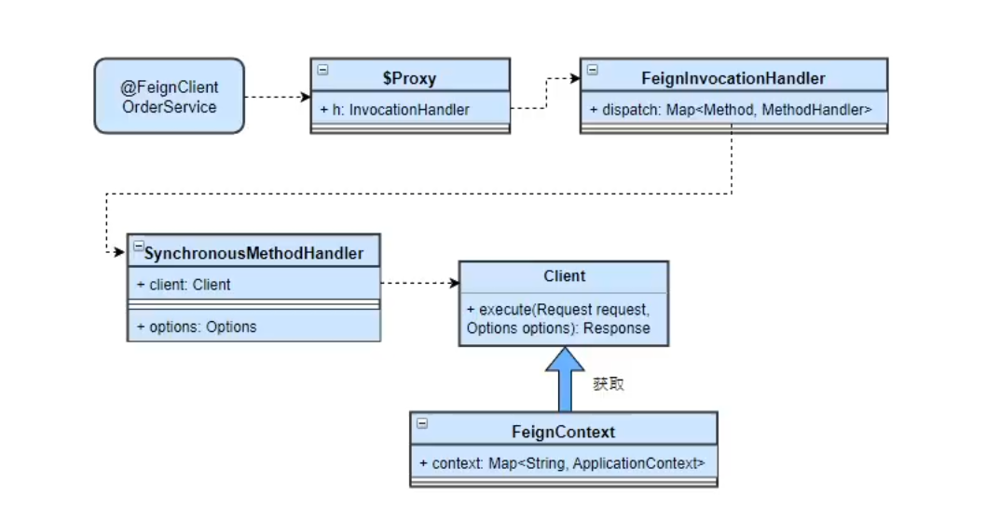
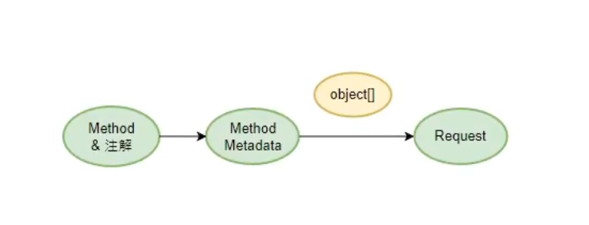

# Open Feign 源码解析四 请求对象的构造（上）

### 前三章节回顾



前三章的内容归纳起来就是讲了这样的问题：

如何把接口转换为具有发送http请求能力的feign client对象以及如何整合到Spring容器中？


## 如何构造请求对象?

### 思路分析

#### Http请求对象的分析（目标）

URL: http://127.0.0.1:9000/consumer/feign/order/{1}?name=xxx&age=18

​	协议: http

​	IP端口: 127.0.0.1:9000 -> 注册中心获取

​	URI: /consumer/feign/order/{id}  

​	路径参:  {1} (path variable)

​	请求参：name=xxx,  age=18 (query)

请求头:   headers

请求体： body

请求方法:   Get/Post/Put/Delete ...

```java
public final class Request {
  private final HttpMethod httpMethod;
  private final String url;
  private final Map<String, Collection<String>> headers;
  private final Body body;
}
```


#### 接口方法的分析（数据源）

方法本身的要素是否能表达所有Http请求的要素？

方法的要素：

​	方法名  ×

​    参数(名称与类型) √

​    返回值类型  ×


URI -> 注解 或 Java对象（URI对象）表示

请求方法 -> 注解

路径参、请求参、请求头、请求体 -> 方法的入参 + 注解


#### 问题一：注解如何设计？

1）URI 和 请求方法可以合并在一个注解中

2）对路径参、请求参、请求头、请求体分别设置对应的注解

##### feign：

@RequestLine/@Param/@QueryMap/@HeaderMap/@Body

##### open feign：

@RequestMapping/@PathVariable/@RequestParam/@SpringQueryMap/@RequestHeader/@RequestBody

URI:  类的@RequestMapping + 方法的@RequestMapping 

请求方法： 方法的@RequestMapping

路径参：参数的@PathVariable

请求参：参数的@RequestParam + @SpringQueryMap

请求头:  类的@RequestMapping(produce/consume/header) 

​              方法的@RequestMapping(produce/consume/header)

​              参数的@RequestHeader


#### 问题二：为什么选择SpringMVC注解？

SpringMVC： http 请求 -> Java 对象

open feign：Java 对象 -> http 请求 


对于方法和注解信息，可以封装在新的对象中 -> 方法元数据

#### 方法元数据的分析

1)  各种参数的位置（索引）

2）参数名称，类型

3）参数类型转换器

4）编码信息

```java
public final class MethodMetadata implements Serializable {

  private static final long serialVersionUID = 1L;
  private String configKey;
  private transient Type returnType;
  private Integer urlIndex;
  private Integer bodyIndex;
  private Integer headerMapIndex;
  private Integer queryMapIndex;
  private boolean queryMapEncoded;
  private transient Type bodyType;
  private RequestTemplate template = new RequestTemplate();
  private List<String> formParams = new ArrayList<String>();
  private Map<Integer, Collection<String>> indexToName =
      new LinkedHashMap<Integer, Collection<String>>();
  private Map<Integer, Class<? extends Expander>> indexToExpanderClass =
      new LinkedHashMap<Integer, Class<? extends Expander>>();
  private Map<Integer, Boolean> indexToEncoded = new LinkedHashMap<Integer, Boolean>();
  private transient Map<Integer, Expander> indexToExpander;
}
```


#### 构造请求对象整体思路：




构建请求对象分两步走：

1）解析方法和注解（类、方法、参数），并把信息封装到方法元数据中  -> 应用启动

2）结合方法元数据和实际参数，构建请求对象 -> 方法调用

实参的类型转换，编码，填充


#### 问题三：如何转换成方法元数据？

1）做成一个组件（Contract）

```java
public interface Contract {
    // 解析接口的注解信息并封装为方法元数据的集合
  	List<MethodMetadata> parseAndValidatateMetadata(Class<?> targetType);
}
```


模板方法的设计模式

​	接口  + 抽象实现 + 默认实现

​		接口：提供扩展性 -> Contract

​		抽象实现： 抽取公共逻辑 -> BaseContract

​		默认实现：提供基本功能的使用 -> Default,   SpringMvcContract


2）Contract组件从何获得？

Springboot自动装配 + 从FeignContext获取

```java
@Configuration(proxyBeanMethods = false)
public class FeignClientsConfiguration {

    @Bean
	@ConditionalOnMissingBean
	public Contract feignContract(ConversionService feignConversionService) {
		return new SpringMvcContract(this.parameterProcessors, feignConversionService);
	}
}
```


### 源码解读

#### BaseContract

解析注解的顺序：类 -> 方法 -> 参数

```java
abstract class BaseContract implements Contract {

    /** 解析接口的注解信息并封装为方法元数据的集合 */
    @Override
    public List<MethodMetadata> parseAndValidatateMetadata(Class<?> targetType) {
          // 接口不能带有泛型
          checkState(targetType.getTypeParameters().length == 0, "Parameterized types unsupported: %s",
              targetType.getSimpleName());

          // 接口最多只能有一个父接口
          checkState(targetType.getInterfaces().length <= 1, "Only single inheritance supported: %s",
              targetType.getSimpleName());

          // 如果传入的接口有一个父接口 那么该父接口必须是顶级接口 
          if (targetType.getInterfaces().length == 1) {
            checkState(targetType.getInterfaces()[0].getInterfaces().length == 0,
                "Only single-level inheritance supported: %s",
                targetType.getSimpleName());
          }

          // 新建一个结果集容器  
          Map<String, MethodMetadata> result = new LinkedHashMap<String, MethodMetadata>();
          // 获取所有public方法，包括从父接口继承而来的  
          for (Method method : targetType.getMethods()) {
            // 排除掉从Object继承的方法，static方法，接口中的default方法
            if (method.getDeclaringClass() == Object.class ||
                (method.getModifiers() & Modifier.STATIC) != 0 ||
                Util.isDefault(method)) {
              continue;
            }
            // 把方法解析为方法元数据 【关键代码】 
            MethodMetadata metadata = parseAndValidateMetadata(targetType, method);
            // 重写方法不支持  
            checkState(!result.containsKey(metadata.configKey()), "Overrides unsupported: %s",
                metadata.configKey());
            result.put(metadata.configKey(), metadata);
          }
          return new ArrayList<>(result.values());
    }

    /** 解析方法的注解并封装为方法元数据对象 */
    protected MethodMetadata parseAndValidateMetadata(Class<?> targetType, Method method) {
          // 创建MethodMetadata对象
          MethodMetadata data = new MethodMetadata();

          // 设置返回值
          data.returnType(Types.resolve(targetType, targetType, method.getGenericReturnType()));

          // 设置configKey,方法的唯一标识: 接口名#方法名(参数类型名称1,参数类型名称2)
          data.configKey(Feign.configKey(targetType, method));

          // 如果有父接口先处理父接口
          if (targetType.getInterfaces().length == 1) {
            processAnnotationOnClass(data, targetType.getInterfaces()[0]);
          }
          // 再处理当前接口 【关键代码】
          processAnnotationOnClass(data, targetType);

          // 处理方法的注解 【关键代码】
          for (Annotation methodAnnotation : method.getAnnotations()) {
            processAnnotationOnMethod(data, methodAnnotation, method);
          }

          // 只支持GET POST等http方法
          checkState(data.template().method() != null,
              "Method %s not annotated with HTTP method type (ex. GET, POST)",
              method.getName());

		  // 获取参数原始类型
          Class<?>[] parameterTypes = method.getParameterTypes();
          // 获取参数通用类型
          Type[] genericParameterTypes = method.getGenericParameterTypes();
          // 获取参数注解 二维数组:因为可以有多个参数 每个参数有多个注解
          Annotation[][] parameterAnnotations = method.getParameterAnnotations();
        
          int count = parameterAnnotations.length;
          for (int i = 0; i < count; i++) {
            boolean isHttpAnnotation = false;
            if (parameterAnnotations[i] != null) {
               // 处理每个参数的注解 如果其中有一个注解属于http注解 则isHttpAnnotation为true 
               // 哪些属于http注解？如SpringMVC的@RequestHeader @PathVariable @RequestParam @SpringQueryMap
               //【关键代码】
               isHttpAnnotation = processAnnotationsOnParameter(data, parameterAnnotations[i], i);
            }
              
            if (parameterTypes[i] == URI.class) {
               data.urlIndex(i);
            } else if (!isHttpAnnotation && parameterTypes[i] != Request.Options.class) {
               // 参数类型不是URI或Options 也没有加http注解 则该参数判定为body 
               checkState(data.formParams().isEmpty(),
                  "Body parameters cannot be used with form parameters.");
               checkState(data.bodyIndex() == null, "Method has too many Body parameters: %s", method);
               // 设置body的位置和类型【关键代码】
               data.bodyIndex(i);
               data.bodyType(Types.resolve(targetType, targetType, genericParameterTypes[i]));
            }
          }

          // ...

          return data;
    }

	/** 处理类上的注解 */
    protected abstract void processAnnotationOnClass(MethodMetadata data, Class<?> clz);

    /** 处理方法上的注解 */
    protected abstract void processAnnotationOnMethod(MethodMetadata data, Annotation annotation, Method method);

	/** 处理参数上的注解 */
    protected abstract boolean processAnnotationsOnParameter(MethodMetadata data, Annotation[] annotations, int paramIndex);
  }
```

#### SpringMvcContract

类：@RequestMapping

方法：@RequestMapping

参数：@PathVariable @SpringQueryMap @RequestHeader @RequestParam

 

@RequestMapping

```java
@Target({ElementType.TYPE, ElementType.METHOD})
@Retention(RetentionPolicy.RUNTIME)
@Documented
@Mapping
public @interface RequestMapping {

   @AliasFor("path")
   String[] value() default {};

   @AliasFor("value")
   String[] path() default {};

   /**
    * The HTTP request methods to map to, narrowing the primary mapping:
    * GET, POST, HEAD, OPTIONS, PUT, PATCH, DELETE, TRACE.
    */
   RequestMethod[] method() default {};

   String[] params() default {};

   String[] headers() default {};

   /**
    * header的Content-Type
    */
   String[] consumes() default {};

   /**
	* header的Accept
    */
   String[] produces() default {};

}
```


```java
public class SpringMvcContract extends Contract.BaseContract implements ResourceLoaderAware {

	private static final String ACCEPT = "Accept";

	private static final String CONTENT_TYPE = "Content-Type";

	private static final TypeDescriptor STRING_TYPE_DESCRIPTOR = TypeDescriptor
			.valueOf(String.class);

	private static final TypeDescriptor ITERABLE_TYPE_DESCRIPTOR = TypeDescriptor
			.valueOf(Iterable.class);

	private static final ParameterNameDiscoverer PARAMETER_NAME_DISCOVERER = new DefaultParameterNameDiscoverer();

    // 参数处理器 可以自动装配也可以使用默认的处理器
	private final Map<Class<? extends Annotation>, AnnotatedParameterProcessor> annotatedArgumentProcessors;

	private final Map<String, Method> processedMethods = new HashMap<>();

	private final ConversionService conversionService;

	private final ConvertingExpanderFactory convertingExpanderFactory;

	private ResourceLoader resourceLoader = new DefaultResourceLoader();

	public SpringMvcContract(
			List<AnnotatedParameterProcessor> annotatedParameterProcessors,
			ConversionService conversionService) {
		Assert.notNull(annotatedParameterProcessors,
				"Parameter processors can not be null.");
		Assert.notNull(conversionService, "ConversionService can not be null.");

        // 初始化参数处理器
		List<AnnotatedParameterProcessor> processors;
		if (!annotatedParameterProcessors.isEmpty()) {
			processors = new ArrayList<>(annotatedParameterProcessors);
		}
		else {
			processors = getDefaultAnnotatedArgumentsProcessors();
		}
		this.annotatedArgumentProcessors = toAnnotatedArgumentProcessorMap(processors);
        
        // 创建参数转换器工厂 真正的转换功能来自conversionService
		this.conversionService = conversionService;
		this.convertingExpanderFactory = new ConvertingExpanderFactory(conversionService);
	}

    /** 获取默认处理器 */
	private List<AnnotatedParameterProcessor> getDefaultAnnotatedArgumentsProcessors() {

		List<AnnotatedParameterProcessor> annotatedArgumentResolvers = new ArrayList<>();
		annotatedArgumentResolvers.add(new PathVariableParameterProcessor()); // 处理@PathVavirable
		annotatedArgumentResolvers.add(new RequestParamParameterProcessor()); // 处理@RequestParam
		annotatedArgumentResolvers.add(new RequestHeaderParameterProcessor()); // 处理@RequestHeader
		annotatedArgumentResolvers.add(new QueryMapParameterProcessor()); // 处理@SpringQueryMap
		return annotatedArgumentResolvers;
	}
    
    @Override
	public MethodMetadata parseAndValidateMetadata(Class<?> targetType, Method method) {
        // 方法先放入缓存中 表示已经处理
		this.processedMethods.put(Feign.configKey(targetType, method), method);
        
        // 调用父类的parseAndValidateMetadata
		MethodMetadata md = super.parseAndValidateMetadata(targetType, method);

        // 处理类上的RequestMapping注解
        // 因为RequestMapping注解可以加在类上和方法上 两者中注解值有优先级问题
		RequestMapping classAnnotation = findMergedAnnotation(targetType,
				RequestMapping.class);
		if (classAnnotation != null) {
			// 解析header中的produces
            // 此时可能已经从方法的RequestMapping注解获得produces的值
            // 这样处理表示方法上的RequestMapping注解优先于类上的RequestMapping注解
			if (!md.template().headers().containsKey(ACCEPT)) {
				parseProduces(md, method, classAnnotation);
			}

			// 解析header中的consumes 原理同produces
			if (!md.template().headers().containsKey(CONTENT_TYPE)) {
				parseConsumes(md, method, classAnnotation);
			}

			// 解析headers
			parseHeaders(md, method, classAnnotation);
		}
		return md;
	}
    
    /** 处理类上的注解(RequestMapping) */
	@Override
	protected void processAnnotationOnClass(MethodMetadata data, Class<?> clz) {
		if (clz.getInterfaces().length == 0) {
			RequestMapping classAnnotation = findMergedAnnotation(clz,
					RequestMapping.class);
            // 这里只处理类上RequestMapping的path,
            // 其他produces, consumes, headers放在解析方法上的RequestMapping注解之后
			if (classAnnotation != null) {
				// 如果类上的@RequestMapping有value(path) 处理后放入uri中
				if (classAnnotation.value().length > 0) {
					String pathValue = emptyToNull(classAnnotation.value()[0]);
                    // 解析path中的${} 
					pathValue = resolve(pathValue);
                    // 保证uri以/开头
					if (!pathValue.startsWith("/")) {
						pathValue = "/" + pathValue;
					}
                    // 放入uri中
					data.template().uri(pathValue);
				}
			}
		}
	}

	/** 处理方法上的注解(RequestMapping) */
	@Override
	protected void processAnnotationOnMethod(MethodMetadata data,
			Annotation methodAnnotation, Method method) {
        // 如果不是@RequestMapping注解本身 也不带有@RequestMapping注解的话就返回
		if (!RequestMapping.class.isInstance(methodAnnotation) && !methodAnnotation
				.annotationType().isAnnotationPresent(RequestMapping.class)) {
			return;
		}

		RequestMapping methodMapping = findMergedAnnotation(method, RequestMapping.class);
		// 解析HTTP Method
		RequestMethod[] methods = methodMapping.method();
		if (methods.length == 0) {
			methods = new RequestMethod[] { RequestMethod.GET };
		}
		checkOne(method, methods, "method");
		data.template().method(Request.HttpMethod.valueOf(methods[0].name()));

		// 解析path
		checkAtMostOne(method, methodMapping.value(), "value");
		if (methodMapping.value().length > 0) {
			String pathValue = emptyToNull(methodMapping.value()[0]);
			if (pathValue != null) {
				pathValue = resolve(pathValue);
				if (!pathValue.startsWith("/") && !data.template().path().endsWith("/")) {
					pathValue = "/" + pathValue;
				}
				data.template().uri(pathValue, true);
			}
		}

		// 解析header中的produces
		parseProduces(data, method, methodMapping);

		// 解析header中的consumes
		parseConsumes(data, method, methodMapping);

		// 解析headers
		parseHeaders(data, method, methodMapping);

		data.indexToExpander(new LinkedHashMap<Integer, Param.Expander>());
	}

	/** 处理参数上的注解 */
	@Override
	protected boolean processAnnotationsOnParameter(MethodMetadata data,
			Annotation[] annotations, int paramIndex) {
		boolean isHttpAnnotation = false;

		AnnotatedParameterProcessor.AnnotatedParameterContext context = new SimpleAnnotatedParameterContext(
				data, paramIndex);
		Method method = this.processedMethods.get(data.configKey());
		for (Annotation parameterAnnotation : annotations) {
            // 根据参数注解类型获取对应的参数处理器
			AnnotatedParameterProcessor processor = this.annotatedArgumentProcessors
					.get(parameterAnnotation.annotationType());
			if (processor != null) {
				Annotation processParameterAnnotation;
				processParameterAnnotation = synthesizeWithMethodParameterNameAsFallbackValue(
						parameterAnnotation, method, paramIndex);
                // 参数处理器处理【关键代码】
				isHttpAnnotation |= processor.processArgument(context,
						processParameterAnnotation, method);
			}
		}

        // 如果是http注解并且没有对应的expander
        // 什么expander -> 参数转换器
		if (isHttpAnnotation && data.indexToExpander().get(paramIndex) == null) {
			TypeDescriptor typeDescriptor = createTypeDescriptor(method, paramIndex);
			if (this.conversionService.canConvert(typeDescriptor,
					STRING_TYPE_DESCRIPTOR)) {
				Param.Expander expander = this.convertingExpanderFactory
						.getExpander(typeDescriptor);
				if (expander != null) {
					data.indexToExpander().put(paramIndex, expander);
				}
			}
		}
		return isHttpAnnotation;
	}
    // ...
}
```


#### AnnotatedParameterProcessor

PathVariableParameterProcessor：@PathVariable 解析路径参数

QueryMapParameterProcessor: @SpringQueryMap 解析请求参数 

RequestHeaderParameterProcessor: @RequestHeader 解析请求头

RequestParamParameterProcessor：@RequestParam 解析请求参数


QueryMapParameterProcessor 与 RequestParamParameterProcessor的区别：

前者可以解析自定义实体对象，Map和基本类型，没有特别的限制

后者只能解析Map和基本类型不能解析自定义对象类型


##### QueryMapParameterProcessor 

```java
public class QueryMapParameterProcessor implements AnnotatedParameterProcessor {

	private static final Class<SpringQueryMap> ANNOTATION = SpringQueryMap.class;

	@Override
	public Class<? extends Annotation> getAnnotationType() {
		return ANNOTATION;
	}

	@Override
	public boolean processArgument(AnnotatedParameterContext context,
			Annotation annotation, Method method) {
		int paramIndex = context.getParameterIndex();
		MethodMetadata metadata = context.getMethodMetadata();
        // 对@SpringQueryMap注解所对应的参数的类型没有限制
		if (metadata.queryMapIndex() == null) {
			metadata.queryMapIndex(paramIndex);
			metadata.queryMapEncoded(SpringQueryMap.class.cast(annotation).encoded());
		}
		return true;
	}
}
```

##### RequestParamParameterProcessor

```java
public class RequestParamParameterProcessor implements AnnotatedParameterProcessor {

	private static final Class<RequestParam> ANNOTATION = RequestParam.class;

	@Override
	public Class<? extends Annotation> getAnnotationType() {
		return ANNOTATION;
	}

	@Override
	public boolean processArgument(AnnotatedParameterContext context,
			Annotation annotation, Method method) {
		int parameterIndex = context.getParameterIndex();
		Class<?> parameterType = method.getParameterTypes()[parameterIndex];
		MethodMetadata data = context.getMethodMetadata();

        // 参数必须是Map类型 否则不可以成为QueryMap
		if (Map.class.isAssignableFrom(parameterType)) {
			checkState(data.queryMapIndex() == null,
					"Query map can only be present once.");
			data.queryMapIndex(parameterIndex);

			return true;
		}

		RequestParam requestParam = ANNOTATION.cast(annotation);
		String name = requestParam.value();
		checkState(emptyToNull(name) != null,
				"RequestParam.value() was empty on parameter %s", parameterIndex);
		context.setParameterName(name);

		Collection<String> query = context.setTemplateParameter(name,
				data.template().queries().get(name));
		data.template().query(name, query);
		return true;
	}
}
```


实参类型转换和填充

```java
interface Expander {

    /**
     * Expands the value into a string. Does not accept or return null.
     */
    String expand(Object value);
}
```


```java
public class SpringMvcContract extends Contract.BaseContract implements ResourceLoaderAware {

    private static final TypeDescriptor STRING_TYPE_DESCRIPTOR = TypeDescriptor
			.valueOf(String.class);
    
	private static class ConvertingExpanderFactory {

		private final ConversionService conversionService;

		ConvertingExpanderFactory(ConversionService conversionService) {
			this.conversionService = conversionService;
		}

		Param.Expander getExpander(TypeDescriptor typeDescriptor) {
			return value -> {
				Object converted = this.conversionService.convert(value, typeDescriptor,
						STRING_TYPE_DESCRIPTOR);
				return (String) converted;
			};
		}

	}
}
```


Java 中的所有类型
raw type：原始类型，对应 Class
即我们通常说的引用类型，包括普通的类，例如 String.class、List.class
也包括数组(Array.class)、接口(Cloneable.class)、注解(Annotation.class)、枚举(Enum.class)等
primitive types：基本类型，对应 Class
包括 Built-in 内置类型，例如 int.class、char.class、void.class
也包括 Wrappers 内置类型包装类型，例如 Integer.class、Boolean.class、Void.class
parameterized types：参数化类型，对应 ParameterizedType
带有类型参数的类型，即常说的泛型，例如 List<T>、Map<Integer, String>、List<? extends Number>
实现类 sun.reflect.generics.reflectiveObjects.ParameterizedTypeImpl
type variables：类型变量类型，对应 TypeVariable<D>
即参数化类型 ParameterizedType 中的 E、K 等类型变量，表示泛指任何类
实现类 sun.reflect.generics.reflectiveObjects.TypeVariableImpl
array types：泛型数组类型，对应 GenericArrayType
元素类型是参数化类型或者类型变量的泛型数组类型，例如 T[]
实现类 sun.reflect.generics.reflectiveObjects.GenericArrayTypeImpl
Type 接口的另一个子接口 WildcardType 代表通配符表达式类型，或泛型表达式类型，比如?、? super T、? extends T，他并不是 Java 类型中的一种。


```java
private static class BuildTemplateByResolvingArgs implements RequestTemplate.Factory {

    private final QueryMapEncoder queryMapEncoder;

    protected final MethodMetadata metadata;
    private final Map<Integer, Expander> indexToExpander = new LinkedHashMap<Integer, Expander>();

    /** 通过metadata信息和实参创建RequestTemplate */
    @Override
    public RequestTemplate create(Object[] argv) {
        
      // 把metadata中的半成品template拷贝一份  
      RequestTemplate mutable = RequestTemplate.from(metadata.template());
        
      // 处理URI对象
      if (metadata.urlIndex() != null) {
        int urlIndex = metadata.urlIndex();
        checkArgument(argv[urlIndex] != null, "URI parameter %s was null", urlIndex);
        mutable.target(String.valueOf(argv[urlIndex]));
      }
        
      //  
      Map<String, Object> varBuilder = new LinkedHashMap<String, Object>();
      for (Entry<Integer, Collection<String>> entry : metadata.indexToName().entrySet()) {
        int i = entry.getKey();
        Object value = argv[entry.getKey()];
        if (value != null) { // Null values are skipped.
          if (indexToExpander.containsKey(i)) {
            value = expandElements(indexToExpander.get(i), value);
          }
          for (String name : entry.getValue()) {
            varBuilder.put(name, value);
          }
        }
      }

      RequestTemplate template = resolve(argv, mutable, varBuilder);
        
      // 处理queryMap
      if (metadata.queryMapIndex() != null) {
        // add query map parameters after initial resolve so that they take
        // precedence over any predefined values
        Object value = argv[metadata.queryMapIndex()];
        Map<String, Object> queryMap = toQueryMap(value);
        template = addQueryMapQueryParameters(queryMap, template);
      }

      // 处理headerMap
      if (metadata.headerMapIndex() != null) {
        template =
            addHeaderMapHeaders((Map<String, Object>) argv[metadata.headerMapIndex()], template);
      }

      return template;
    }
    

    @SuppressWarnings("unchecked")
    private RequestTemplate addHeaderMapHeaders(Map<String, Object> headerMap,
                                                RequestTemplate mutable) {
      for (Entry<String, Object> currEntry : headerMap.entrySet()) {
        Collection<String> values = new ArrayList<String>();

        Object currValue = currEntry.getValue();
        if (currValue instanceof Iterable<?>) {
          Iterator<?> iter = ((Iterable<?>) currValue).iterator();
          while (iter.hasNext()) {
            Object nextObject = iter.next();
            values.add(nextObject == null ? null : nextObject.toString());
          }
        } else {
          values.add(currValue == null ? null : currValue.toString());
        }

        mutable.header(currEntry.getKey(), values);
      }
      return mutable;
    }

    @SuppressWarnings("unchecked")
    private RequestTemplate addQueryMapQueryParameters(Map<String, Object> queryMap,
                                                       RequestTemplate mutable) {
      for (Entry<String, Object> currEntry : queryMap.entrySet()) {
        Collection<String> values = new ArrayList<String>();

        boolean encoded = metadata.queryMapEncoded();
        Object currValue = currEntry.getValue();
        if (currValue instanceof Iterable<?>) {
          Iterator<?> iter = ((Iterable<?>) currValue).iterator();
          while (iter.hasNext()) {
            Object nextObject = iter.next();
            values.add(nextObject == null ? null
                : encoded ? nextObject.toString()
                    : UriUtils.encode(nextObject.toString()));
          }
        } else {
          values.add(currValue == null ? null
              : encoded ? currValue.toString() : UriUtils.encode(currValue.toString()));
        }

        mutable.query(encoded ? currEntry.getKey() : UriUtils.encode(currEntry.getKey()), values);
      }
      return mutable;
    }

    // ...
}
```

