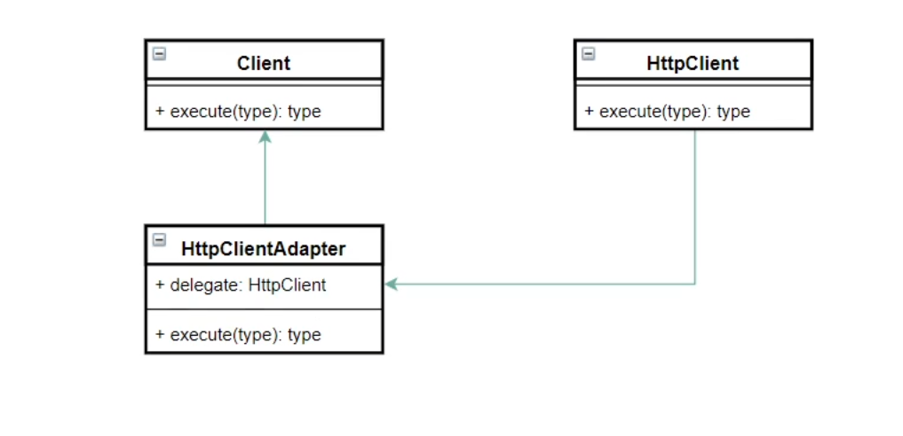
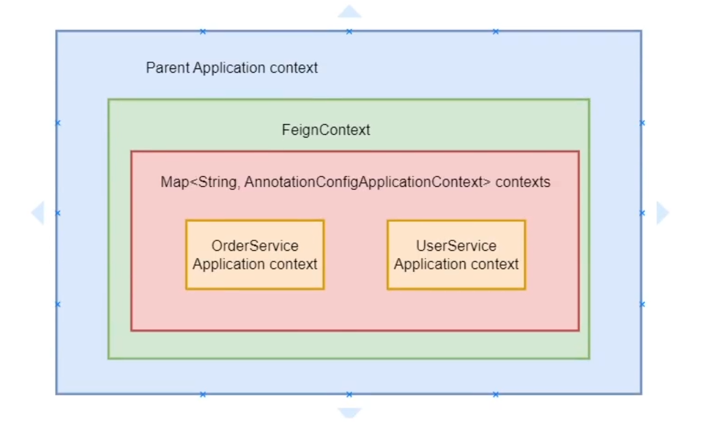

# Open Feign 源码解析二 如何发送http请求？


## 如何组件化？

### 定义接口

```java
public interface Client {
	Response execute(Request request, Options options) throws IOException;
}
```


### 是否存在已有的方案？

1）rest template

2)   http client

3)   ok http 。。。


### 如何整合已有的方案？



```java
/** http client的适配器 */
public final class ApacheHttpClient implements Client {
 
  private final HttpClient client;

  public ApacheHttpClient(HttpClient client) {
    this.client = client;
  }

  @Override
  public Response execute(Request request, Request.Options options) throws IOException {
    HttpUriRequest httpUriRequest;
    try {
      httpUriRequest = toHttpUriRequest(request, options);
    } catch (URISyntaxException e) {
      throw new IOException("URL '" + request.url() + "' couldn't be parsed into a URI", e);
    }
    HttpResponse httpResponse = client.execute(httpUriRequest);
    return toFeignResponse(httpResponse, request);
  }
}

/** ok http 的适配器 */
public final class OkHttpClient implements Client {
    
  private final okhttp3.OkHttpClient delegate;

  public OkHttpClient(okhttp3.OkHttpClient delegate) {
    this.delegate = delegate;
  }

 @Override
  public feign.Response execute(feign.Request input, feign.Request.Options options)
      throws IOException {
    okhttp3.OkHttpClient requestScoped;
    if (delegate.connectTimeoutMillis() != options.connectTimeoutMillis()
        || delegate.readTimeoutMillis() != options.readTimeoutMillis()) {
      requestScoped = delegate.newBuilder()
          .connectTimeout(options.connectTimeoutMillis(), TimeUnit.MILLISECONDS)
          .readTimeout(options.readTimeoutMillis(), TimeUnit.MILLISECONDS)
          .followRedirects(options.isFollowRedirects())
          .build();
    } else {
      requestScoped = delegate;
    }
    Request request = toOkHttpRequest(input);
    Response response = requestScoped.newCall(request).execute();
    return toFeignResponse(response, input).toBuilder().request(input).build();
  }
}
```


适配器需要引入的包(Pom.xml)

```xml
<dependency>
	<groupId>io.github.openfeign</groupId>
	<artifactId>feign-httpclient</artifactId>
</dependency>

<dependency>
	<groupId>io.github.openfeign</groupId>
	<artifactId>feign-okhttp</artifactId>
</dependency>
```


### 如何动态选择实现方案？

插拔式：

提供几种思路：

1）JAVA SPI -> 无法提供依赖注入，无法动态地选择实现类

2）Dubbo SPI -> 额外添加dubbo依赖，Dubbo SPI 与其业务模型耦合

3）springboot的自动装配 ->  open feign 作为spirngcloud组件之一直接依托于springboot


#### 技巧：如何快速找到自动装配类？

1）Ctrl+G  -> find Usages 功能  寻找new Instance

2）通过名字去猜  autoconfiguration结尾， 其中带有feign开头

3）直接通过 spring.factories 文件去搜索

spring-cloud-openfeign-core-2.2.1.RELEASE.jar -> META-INF/spring.factories

```txt
org.springframework.boot.autoconfigure.EnableAutoConfiguration=\
org.springframework.cloud.openfeign.ribbon.FeignRibbonClientAutoConfiguration,\
org.springframework.cloud.openfeign.hateoas.FeignHalAutoConfiguration,\
org.springframework.cloud.openfeign.FeignAutoConfiguration,\
org.springframework.cloud.openfeign.encoding.FeignAcceptGzipEncodingAutoConfiguration,\
org.springframework.cloud.openfeign.encoding.FeignContentGzipEncodingAutoConfiguration,\
org.springframework.cloud.openfeign.loadbalancer.FeignLoadBalancerAutoConfiguration
```


#### feign 的带负载均衡的自动配置类

```java
@Import({ HttpClientFeignLoadBalancedConfiguration.class,
		OkHttpFeignLoadBalancedConfiguration.class,
		DefaultFeignLoadBalancedConfiguration.class })
public class FeignRibbonClientAutoConfiguration {
	// ...
}
```

#### HttpClient适配器的配置类

```java
@Configuration(proxyBeanMethods = false)
@ConditionalOnClass(ApacheHttpClient.class)
@ConditionalOnProperty(value = "feign.httpclient.enabled", matchIfMissing = true)
@Import(HttpClientFeignConfiguration.class)
class HttpClientFeignLoadBalancedConfiguration {

	@Bean
	@ConditionalOnMissingBean(Client.class)
	public Client feignClient(CachingSpringLoadBalancerFactory cachingFactory,
			SpringClientFactory clientFactory, HttpClient httpClient) {
		ApacheHttpClient delegate = new ApacheHttpClient(httpClient);
		return new LoadBalancerFeignClient(delegate, cachingFactory, clientFactory);
	}
}
```

#### HttpClient的配置类

```java
@Configuration(proxyBeanMethods = false)
@ConditionalOnMissingBean(CloseableHttpClient.class)
public class HttpClientFeignConfiguration {

	private final Timer connectionManagerTimer = new Timer(
			"FeignApacheHttpClientConfiguration.connectionManagerTimer", true);

	private CloseableHttpClient httpClient;

	@Autowired(required = false)
	private RegistryBuilder registryBuilder;

	@Bean
	@ConditionalOnMissingBean(HttpClientConnectionManager.class)
	public HttpClientConnectionManager connectionManager(
			ApacheHttpClientConnectionManagerFactory connectionManagerFactory,
			FeignHttpClientProperties httpClientProperties) {
		final HttpClientConnectionManager connectionManager = connectionManagerFactory
				.newConnectionManager(httpClientProperties.isDisableSslValidation(),
						httpClientProperties.getMaxConnections(),
						httpClientProperties.getMaxConnectionsPerRoute(),
						httpClientProperties.getTimeToLive(),
						httpClientProperties.getTimeToLiveUnit(), this.registryBuilder);
		this.connectionManagerTimer.schedule(new TimerTask() {
			@Override
			public void run() {
				connectionManager.closeExpiredConnections();
			}
		}, 30000, httpClientProperties.getConnectionTimerRepeat());
		return connectionManager;
	}

    // ...

	@Bean
	@ConditionalOnProperty(value = "feign.compression.response.enabled",
			havingValue = "false", matchIfMissing = true)
	public CloseableHttpClient httpClient(ApacheHttpClientFactory httpClientFactory,
			HttpClientConnectionManager httpClientConnectionManager,
			FeignHttpClientProperties httpClientProperties) {
		this.httpClient = createClient(httpClientFactory.createBuilder(),
				httpClientConnectionManager, httpClientProperties);
		return this.httpClient;
	}

	private CloseableHttpClient createClient(HttpClientBuilder builder,
			HttpClientConnectionManager httpClientConnectionManager,
			FeignHttpClientProperties httpClientProperties) {
		RequestConfig defaultRequestConfig = RequestConfig.custom()
				.setConnectTimeout(httpClientProperties.getConnectionTimeout())
				.setRedirectsEnabled(httpClientProperties.isFollowRedirects()).build();
		CloseableHttpClient httpClient = builder
				.setDefaultRequestConfig(defaultRequestConfig)
				.setConnectionManager(httpClientConnectionManager).build();
		return httpClient;
	}
}
```

### 如果同时依赖了http client和ok http？

```java
// 依照import的顺序 http client -> ok http -> jdk
@Import({ HttpClientFeignLoadBalancedConfiguration.class,
		OkHttpFeignLoadBalancedConfiguration.class,
		DefaultFeignLoadBalancedConfiguration.class })
public class FeignRibbonClientAutoConfiguration {
	// ...
}
```


### 如何修改配置参数？

方法一：通过配置文件修改FeignHttpClientProperties的参数（属性绑定）

```java
@Configuration(proxyBeanMethods = false)
@ConditionalOnMissingBean(CloseableHttpClient.class)
public class HttpClientFeignConfiguration { // http client的配置类
    @Bean
	@ConditionalOnMissingBean(HttpClientConnectionManager.class)
	public HttpClientConnectionManager connectionManager(
			ApacheHttpClientConnectionManagerFactory connectionManagerFactory,
			FeignHttpClientProperties httpClientProperties) {
		final HttpClientConnectionManager connectionManager = connectionManagerFactory
				.newConnectionManager(httpClientProperties.isDisableSslValidation(),
						httpClientProperties.getMaxConnections(),
						httpClientProperties.getMaxConnectionsPerRoute(),
						httpClientProperties.getTimeToLive(),
						httpClientProperties.getTimeToLiveUnit(), this.registryBuilder);
		this.connectionManagerTimer.schedule(new TimerTask() {
			@Override
			public void run() {
				connectionManager.closeExpiredConnections();
			}
		}, 30000, httpClientProperties.getConnectionTimerRepeat());
		return connectionManager;
	}
}
```

方法二：修改配置类(@Bean) 替换源码中的配置

```java
@Configuration
public class DefaultConfiguration {

    @Bean
    public HttpClientBuilder apacheHttpClientBuilder() {
        // 修改builder参数
        return HttpClientBuilder.create().setMaxConnTotal(1000);
    }
}
```


## 如何装配组件？

### 组件装配到哪里？

答案： SynchronousMethodHandler

```java
public class ReflectiveFeign extends Feign {
    // ...
    
    /** 创建JDK动态代理对象 */
    @Override
    public <T> T newInstance(Target<T> target) {
        Map<String, MethodHandler> nameToHandler = targetToHandlersByName.apply(target);
        Map<Method, MethodHandler> methodToHandler = new LinkedHashMap<Method, MethodHandler>();
        List<DefaultMethodHandler> defaultMethodHandlers = new LinkedList<DefaultMethodHandler>();

        for (Method method : target.type().getMethods()) {
          if (method.getDeclaringClass() == Object.class) {
            continue;
          } else if (Util.isDefault(method)) {
            DefaultMethodHandler handler = new DefaultMethodHandler(method);
            defaultMethodHandlers.add(handler);
            methodToHandler.put(method, handler);
          } else {
            methodToHandler.put(method, nameToHandler.get(Feign.configKey(target.type(), method)));
          }
        }
        // 通过工厂创建FeignInvocationHandler对象并把methodToHandler封装进去
        InvocationHandler handler = factory.create(target, methodToHandler);
        // JDK动态代理的API
        T proxy = (T) Proxy.newProxyInstance(target.type().getClassLoader(),
            new Class<?>[] {target.type()}, handler);

        for (DefaultMethodHandler defaultMethodHandler : defaultMethodHandlers) {
          defaultMethodHandler.bindTo(proxy);
        }
        return proxy;
    }
    
    // jdk动态代理的第三个参数InvocationHandler
    static class FeignInvocationHandler implements InvocationHandler {
        private final Target target;
        private final Map<Method, MethodHandler> dispatch; // 每个方法封装到MethodHandler

        FeignInvocationHandler(Target target, Map<Method, MethodHandler> dispatch) {
          this.target = checkNotNull(target, "target");
          this.dispatch = checkNotNull(dispatch, "dispatch for %s", target);
        }

        @Override
        public Object invoke(Object proxy, Method method, Object[] args) throws Throwable {
          if ("equals".equals(method.getName())) {
            try {
              Object otherHandler =
                  args.length > 0 && args[0] != null ? Proxy.getInvocationHandler(args[0]) : null;
              return equals(otherHandler);
            } catch (IllegalArgumentException e) {
              return false;
            }
          } else if ("hashCode".equals(method.getName())) {
            return hashCode();
          } else if ("toString".equals(method.getName())) {
            return toString();
          }

          return dispatch.get(method).invoke(args);
        }
    }
}
```

```java
final class SynchronousMethodHandler implements MethodHandler {

  private final MethodMetadata metadata;
  private final Target<?> target;
  private final Client client; // http 请求客户端
  private final Retryer retryer;
  private final List<RequestInterceptor> requestInterceptors;
  private final Logger logger;
  private final Logger.Level logLevel;
  private final RequestTemplate.Factory buildTemplateFromArgs;
  private final Options options;
  // ...
    
  private SynchronousMethodHandler(Target<?> target, Client client, Retryer retryer,
      List<RequestInterceptor> requestInterceptors, Logger logger,
      Logger.Level logLevel, MethodMetadata metadata,
      RequestTemplate.Factory buildTemplateFromArgs, Options options,
      Decoder decoder, ErrorDecoder errorDecoder, boolean decode404,
      boolean closeAfterDecode, ExceptionPropagationPolicy propagationPolicy) {
    // ...
    this.client = checkNotNull(client, "client for %s", target);
    // ...
  }
    
  /** 真正地调用每个方法 */  
  @Override
  public Object invoke(Object[] argv) throws Throwable {
    RequestTemplate template = buildTemplateFromArgs.create(argv);
    Options options = findOptions(argv);
    Retryer retryer = this.retryer.clone();
    while (true) {
      try {
        return executeAndDecode(template, options); // 调用client
      } catch (RetryableException e) {
        try {
          retryer.continueOrPropagate(e);
        } catch (RetryableException th) {
          Throwable cause = th.getCause();
          if (propagationPolicy == UNWRAP && cause != null) {
            throw cause;
          } else {
            throw th;
          }
        }
        if (logLevel != Logger.Level.NONE) {
          logger.logRetry(metadata.configKey(), logLevel);
        }
        continue;
      }
    }
  }
    
    
  Object executeAndDecode(RequestTemplate template, Options options) throws Throwable {
    Request request = targetRequest(template);

    if (logLevel != Logger.Level.NONE) {
      logger.logRequest(metadata.configKey(), logLevel, request);
    }

    Response response;
    long start = System.nanoTime();
    try {
      response = client.execute(request, options); // 调用client组件的execute方法
    } catch (IOException e) {
      if (logLevel != Logger.Level.NONE) {
        logger.logIOException(metadata.configKey(), logLevel, e, elapsedTime(start));
      }
      throw errorExecuting(request, e);
    }
    // ...
  }  
}
```


### 如何获取组件？

1) Autowired 自动装配

2) 获取BeanFactory或ApplicationContext，再从里面获取



### 如何传递组件？

通过 Feign.Builder 传给 SynchronousMethodHandler.Factory ->SynchronousMethodHandler

## 总结：

设计：组件化思维

技术点：适配器模式，springboot自动装配（@Conditional注解的解读，@Import注解的顺序）， 父子容器